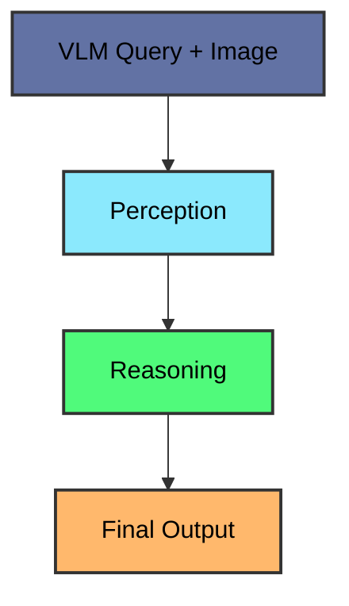
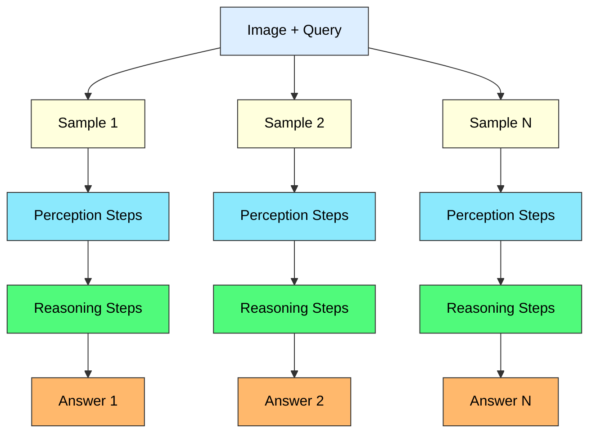
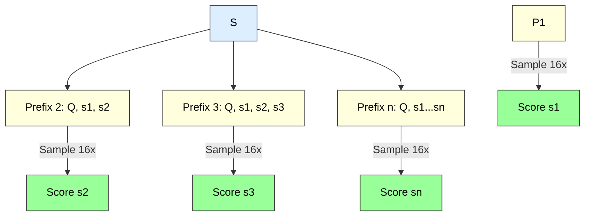
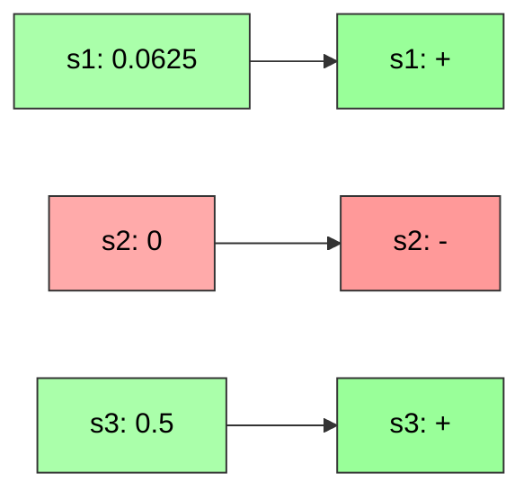
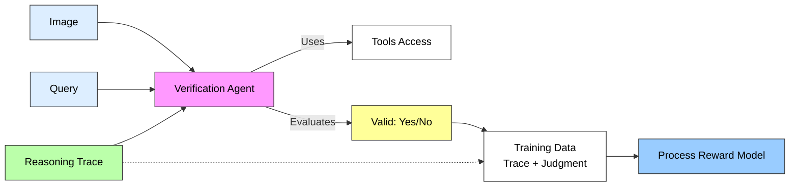
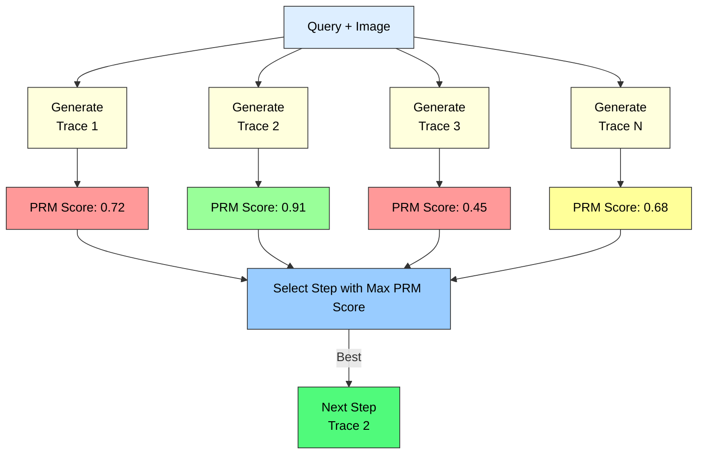

---
# You can also start simply with 'default'
theme: default
# Force light mode
colorSchema: light
# random image from a curated Unsplash collection by Anthony
# like them? see https://unsplash.com/collections/94734566/slidev
background: https://cover.sli.dev
# some information about your slides (markdown enabled)
title: "Multimodal Reasoning & RLHF: Training a Process Reward Model"
info: |
  A presentation on training a Process Reward Model using an agentic approach
  to verify the validity of reasoning generated by a Vision Language Model.

  Learn more at [Sli.dev](https://sli.dev)
# apply unocss classes to the current slide
class: text-center
# https://sli.dev/features/drawing
drawings:
  persist: false
# slide transition: https://sli.dev/guide/animations.html#slide-transitions
transition: slide-left
# enable MDC Syntax: https://sli.dev/features/mdc
mdc: true
# open graph
# seoMeta:
#  ogImage: https://cover.sli.dev
# add scripts for Twitter widget
headersFrontmatter:
  scripts:
    - src: https://platform.twitter.com/widgets.js
      async: true
---

# Reinforcement Finetuning for Multimodal Reasoning Part 1

### Test-Time Scaling, Self-Improving Agents, Small Models, Reinforcement Learning, Reward Models

<div class="abs-br m-6 text-xl">
  <button @click="$slidev.nav.openInEditor()" title="Open in Editor" class="slidev-icon-btn">
    <carbon:edit />
  </button>
  <!-- <a href="https://github.com/slidevjs/slidev" target="_blank" class="slidev-icon-btn">
    <carbon:logo-github />
  </a> -->
</div>

<!--
The last comment block of each slide will be treated as slide notes. It will be visible and editable in Presenter Mode along with the slide. [Read more in the docs](https://sli.dev/guide/syntax.html#notes)
-->

---
layout: default
---

# Motivation

Automating Concur expense claims using computer vision agents.
The goal was to have an agent:
- Read receipts (or pull them from multiple sources)
- Extract values from receipts as expected by Concur 
- Fill out the Concur form (with Organisation specific business rules)

When analysing the failure modes, noticed errors caused by lack of perception and reasoning intelligence.
- Unable to handle the variability in receipt formats.
- Struggled with adapting to the complex UIUX of Concur.
- Inability to self-recover from errors.

Multi-agent frameworks tried:
- Microsoft Magenta One, Claude Computer Use, Browser Use/Browserbase variants

---
layout: default
---

<div class="flex flex-col space-y-4 items-center">
  
  
</div>

---
layout: default
---

# Research Motivation

1. Understand mechanics of finetuning computer use agents for flexible use cases

2. Explore emerging solutions in reinforcement learning, test-time scaling and small model finetuning

---
layout: default
---

# About Me

<div class="space-y-4">

  <div class="grid grid-cols-3 gap-4 items-center">
    <div class="col-span-2">
      <ul>
        <li><strong>Senior Researcher @ AI Singapore</strong>
          <ul class="text-sm"><li>Researching Multimodal Reasoning, previously led SEALIONv2 training, worked with GoJek on launching their proprietary LLM & Hippocratic AI on finetuning realtime voice agents</li></ul>
        </li>
      </ul>
    </div>
    <div class="flex justify-center">
      
    </div>
  </div>

  <div class="grid grid-cols-3 gap-4 items-center">
    <div class="col-span-2">
      <ul>
        <li><strong>Cofounder & CTO @ Gigit.AI</strong>
          <ul class="text-sm"><li>Sequoia & Pear VC-backed customer support AI.</li></ul>
        </li>
      </ul>
    </div>
    <div class="flex justify-center">
      
    </div>
  </div>

  <div class="grid grid-cols-3 gap-4 items-center">
    <div class="col-span-2">
      <ul>
        <li><strong>Founding Data Engineer @ Workstream.us</strong>
          <ul class="text-sm"><li>Backed by Peter Thiel's Founder's Fund.</li></ul>
        </li>
      </ul>
    </div>
    <div class="flex justify-center">
      
    </div>
  </div>

</div>

---
layout: default
---

# Research Philosophy

Growing conviction that the most impactful AI innovations emerge when **frontier research reaches a critical threshold** where theoretical breakthroughs become engineerable into novel applications.

<div class="mt-6 space-y-4">

**Identifying this turning point demands more than technical expertise:**
- Deep theoretical understanding and systematic methodologies
- Practical engineering execution  
- The instinct to recognize when seemingly disparate advances converge

**Goal:** Identify innovation that happen at inflection points where:
- Scientific progress
- Market needs  
- Available tools

all align simultaneously.

</div>

---
layout: default
---

# Outline

1.  **The Utility of Multimodal Reasoning**
    - Computer Use Agents
    - Custom Enterprise Applications
2. **Background: (Math) Reasoning in LLMs**
    - Majority Voting (Self-Consistency)
2.  **Self-Improving Agents with RL and PRMs**
    - Improving agents with experience without human annotation
    - Verifiable Rewards
3.  **Core Mechanism 1: Monte Carlo Rollouts**
4.  **Core Mechanism 2: Verification of Reasoning Traces**
5.  **PRM At Inference Time**
    - best-of-N sampling
6.  **Conclusion**
    - verifiable environment, priors, and rewards

---
layout: default
---

# The Utility of Multimodal Reasoning

- **Multimodal reasoning** powers computer-use agents like:
  - OpenAI Operator
  - Manus
- ChatGPT's o3 agentic capabilities
  - These systems can use tools to zoom into images, search the web, and use code interpreters to answer complex multimodal queries
- Reasoning beyond text, starting with images

---
layout: center
---

<Tweet id="1912954344724406475" user="minchoi" />

---
layout: default
class: text-small
---

```
<Question>
Where is this location in the image?
[Image: Street view of a city intersection]
</Question>

<crop_tool>
I'll analyze specific parts of this image to identify the location.
[Crop: Street sign visible in upper right]
</crop_tool>

<reasoning>
I can see "8th Ave" on the green street sign. There appears to be text about a "safety walkway." I should also examine other identifying features. The building architecture might provide additional clues.
[Crop: Building with distinctive vertical panels]
The building appears to have a modern design with vertical panels. This could be "220 West 58th" based on the architectural style.
</reasoning>

<web_search_tool>
Searching: "8th Ave intersection near West 58th Street New York"
</web_search_tool>

<reasoning>
The search results confirm this is likely in Manhattan, New York City. The intersection of 8th Avenue and West 58th Street is in Midtown, near Columbus Circle. The architectural style of the building matches buildings in this area. I can now provide a specific answer with high confidence.
</reasoning>

<final_answer>
This location is the intersection of 8th Avenue and West 58th Street in Midtown Manhattan, New York City (coordinates approximately 40.7664° N, 73.9815° W). The image shows the northwest corner of this intersection, looking north up 8th Avenue.
</final_answer>
```

---
layout: default
---

# Emerging Enterprise Applications

## Agents to augment mundane, mission critical reasoning tasks
- Such tasks are often hard to hire and retain employees for
- **Examples**: 
  - Defense and Government: Manual geospatial image analysis 
  - Insurance: Car insurance claims processing
  - Financial Services: Loan application processing, KYC
- Agentic reasoning systems explore workflow automation involving multi-step, visual judgement

---
layout: center
---

<iframe width="760" height="515" src="https://www.youtube.com/embed/dHc6tDcE8wk?start=77" title="YouTube video player" frameborder="0" allow="accelerometer; autoplay; clipboard-write; encrypted-media; gyroscope; picture-in-picture" allowfullscreen></iframe>

---
layout: default
---

# Background: Reasoning is intelligence

## Chain of Thought

- When **chain of thought** was discovered, we discovered an emergent capability for LLMs to reason in a "structured" way
- Even though models were not explicitly trained to perform arithmetic, they could somehow solve complex math problems, and "do computation", with some exceptions
- "Next token prediction" objective enabled "thinking machines"

---
layout: default
---

# The "Let's think step-by-step" Era

### From Single Outputs to Sampling Strategies

- **Key breakthrough**: Prompting with "Let's think step-by-step" dramatically improved reasoning 
- This led to sampling strategies that can be used at inference time to improve output quality
- Example of sampling technique:
  - **Majority Voting (Self-Consistency)**:
    - CoT@32 referes to generating 32 different reasoning chains using Chain-of-Thought prompting
    - Also called self-consistency, where:
      - The model generates multiple reasoning paths for each question
      - Each path produces an answer
      - The final answer is determined by which answer appears most frequently across all samples (and heuristics to determine "most frequent" answer)
- See [MedPrompt+ (promptbase repo) by MSR](https://github.com/microsoft/promptbase) for more details

---
layout: default
---

# Self-Consistency Sampling (Pseudo-Code)

```
FUNCTION Self_Consistency_Sampling(question, model, n_samples=32):
    
    answers = empty list
    
    # Generate multiple reasoning paths with temperature sampling
    FOR i = 1 to n_samples:
        # Add Chain of Thought prompt to encourage step-by-step reasoning
        cot_prompt = question + "Let's think step-by-step:"
        
        # Use temperature sampling (T > 0) to generate diverse reasoning paths
        # Higher temperature = more diversity in the reasoning chains
        reasoning_chain = model.generate(cot_prompt, temperature=0.7)
        
        # Extract the final answer from the reasoning chain
        answer = extract_final_answer(reasoning_chain)
        
        # Store the answer
        add answer to answers
    
    # Count the frequency of each unique answer
    answer_counts = count_frequency(answers)
    
    # Self-consistency: return the most frequent answer
    majority_answer = most_frequent(answer_counts)
    
    RETURN majority_answer
```
---
layout: default
---

# From Reasoning to RL

## Why RLHF? The Alignment Challenge

**Reinforcement Learning from Human Feedback (RLHF)** addresses a fundamental problem:
- **Supervised fine-tuning** teaches models to mimic human examples
- But we want models that can **exceed human performance** while staying aligned with human values
  - AlphaGo Move 37 is a good example of this
- **RLHF solution**: Train a reward model from human preferences, then use RL to optimize for those preferences
- Many training regimes (PPO, GRPO, DPO, etc) for running RL. We will focus NOT on explaining these, but instead on how to train a reward model
  -  Why? Reward models are like "power ups", we can use them with APIs and within systems with custom models to improve performance

---
layout: default
---

# Thought Experiment

- What if we could give feedback to the model about its answer and get the model to "learn our preferences"?
  - Likert scale feedback in RLHF, Outcome Reward Models
- How about at each step of the reasoning process?
  - Process Reward Models
- How can we do this in a way that scales? 
  - Using well-aligned LLMs as reward models to proxy human preferences

---
layout: default
---

# From Reasoning to RL

## Reward Models in RLHF for Reasoning

<div class="mt-4">
<table class="w-full border-collapse">
<thead>
<tr>
<th class="border-b-2 border-gray-300 p-4 text-left bg-gray-50"></th>
<th class="border-b-2 border-gray-300 p-4 text-left bg-blue-50">Outcome Reward Models (ORMs)</th>
<th class="border-b-2 border-gray-300 p-4 text-left bg-green-50">Process Reward Models (PRMs)</th>
</tr>
</thead>
<tbody>
<tr class="border-b border-gray-200">
<td class="p-4 font-semibold">What they do</td>
<td class="p-4">Evaluate correctness of final answers</td>
<td class="p-4">Evaluate each step of reasoning process</td>
</tr>
<tr class="border-b border-gray-200 bg-gray-50">
<td class="p-4 font-semibold">Training signal</td>
<td class="p-4">Binary: Is the answer correct?</td>
<td class="p-4">Step-wise: Is this reasoning step valid?</td>
</tr>
<tr class="border-b border-gray-200">
<td class="p-4 font-semibold">Feedback timing</td>
<td class="p-4">After entire reasoning chain completes</td>
<td class="p-4">During generation at each step</td>
</tr>
<tr class="border-b border-gray-200 bg-gray-50">
<td class="p-4 font-semibold">Supervision</td>
<td class="p-4">Sparse (end-to-end)</td>
<td class="p-4">Dense (step-by-step)</td>
</tr>
<tr>
<td class="p-4 font-semibold">Result</td>
<td class="p-4">May learn shortcuts to correct answers</td>
<td class="p-4">Learns systematic, reliable reasoning</td>
</tr>
</tbody>
</table>
</div>

<div class="mt-6 p-4 bg-yellow-50 rounded-lg text-center">
<strong>Key Insight:</strong> PRMs guide models away from lucky guesses toward robust reasoning patterns
</div>

---
layout: default
---

# Process Reward Models (PRMs) for Multimodal Reasoning

## Self-Play Reinforcement Learning

- We focus on **"self-play" reinforcement learning (RL)** techniques
- Goal: Enhance multimodal reasoning with **minimal human annotation**
- Two key mechanisms:
    - **Monte Carlo Rollouts**: Generate multiple reasoning paths (as in MATH-Shepherd)
    - **Verification of Reasoning Traces**: Verify the validity of reasoning traces (as in GenPRM/Qwen-Math-PRM)
- See [Let's Verify Step by Step](https://arxiv.org/abs/2305.20050) for more details

---
layout: default
---

# Core Mechanism 1: Monte Carlo Rollouts



---
layout: default
---

# Core Mechanism 1: Monte Carlo Rollouts (Illustrated)

## Phase 1: Initial Rollout with Step Forcing

<div class="grid grid-cols-2 gap-4">

<div>

### Process Flow



</div>

<div>

### XML Step Forcing Example

```xml
[Perception]
<step_1>
I see a 3x3 grid with missing cell. Shapes: squares, circles, hexagons
</step_1>
<step_2>
Row 1: 1 square, 2 circles, 3 pentagons. Row 2: 2 circles, 3 hexagons, 4 squares
</step_2>

[Reasoning]
<step_1>
Pattern: count increases left→right. Shape types consistent per row
</step_1>
<step_2>
Missing cell needs 5 shapes. Shape sequence: circle (from row 2)
</step_2>

<correct_answer>
Answer: 5 circles
</correct_answer>
```

</div>

</div>

<div class="mt-4 p-3 bg-blue-50 rounded text-sm">
<strong>Key:</strong> Force model to generate structured steps → Enable step-wise verification later
</div>

---
layout: default
---

# Core Mechanism 1: Monte Carlo Rollouts (Illustrated)

## Phase 2: Step-wise Scoring via Prefix Sampling

<div class="grid grid-cols-2 gap-4">

<div>

### Prefix Building Process



</div>

<div>

### Scoring Example

| Step | Prefix Sampled | MC Correct | Score |
|------|---------------|------------|-------|
| s1: "3x3 grid with missing cell" | [Q, s1] → 16 rollouts | 1/16 | 0.0625 |
| s2: "First column: triangles" | [Q, s1, s2] → 16 rollouts | 4/16 | 0.25 |
| s3: "Second column: pentagons" | [Q, s1, s2, s3] → 16 rollouts | 1/16 | 0.0625 |
| s4: "Third column: circles" | [Q, s1, s2, s3, s4] → 16 rollouts | 4/16 | 0.25 |
| s5: "Pattern: count increases" | [Q, s1...s5] → 16 rollouts | 5/16 | 0.3125 |

<div class="mt-2 p-2 bg-red-50 rounded text-xs">
Score = # correct answers / 16 samples
</div>

</div>

</div>

<div class="mt-4 p-3 bg-green-50 rounded text-sm">
<strong>Output:</strong> Each step gets a score ∈ [0,1] indicating its contribution to correct reasoning
</div>

---
layout: default
---

# Core Mechanism 1: Monte Carlo Rollouts (Illustrated)

## Phase 3: Binary Labeling via Thresholding

<div class="grid grid-cols-2 gap-4">

<div>

### Thresholding Process



</div>

<div>

### Training Data Generation

```
THRESHOLD = 0

for each step in trace:
    if step.score > THRESHOLD:
        label = "+"  # Good step
    else:
        label = "-"  # Bad step
```

```json
{
  "step": "3x3 grid with missing cell",
  "score": 0.0625,
  "label": "+"
},
{
  "step": "Pattern: count increases",
  "score": 0,
  "label": "-"
},
{
  "step": "Wrong shape type",
  "score": 1,
  "label": "+"
}
```

</div>

</div>

<div class="mt-4 p-3 bg-purple-50 rounded text-sm">
<strong>Result:</strong> Binary labeled dataset {(step, +/-)} ready for PRM training
</div>

---
layout: default
---

# Core Mechanism 2: Train a Process Reward Model with Agentic Verification of Reasoning Traces



---
layout: default
class: text-small
---

### Agentic Verification Example

```
<reasoning_trace>
I'll analyze specific parts of this image to identify the location.
[Crop: Street sign visible in upper right]
</reasoning_trace>

<verify>
I need to verify if this reasoning trace is valid. I'll use image analysis and web search tools to check the claims.

<image_analysis_tool>
Analyzing the cropped regions:
- Confirmed: Green street sign shows "8th Ave"
- Confirmed: Building has distinctive vertical panels
</image_analysis_tool>

<web_search_tool>
Search: "8th Avenue West 58th Street Manhattan building with vertical panels"
Results: Found images of this intersection matching the building description. The northwest corner has a modern building with vertical panels.
</web_search_tool>

<reasoning_verification>
The agent correctly identified the street sign and architectural features. The claim about "220 West 58th" is partially accurate - there is a building at that intersection, though the exact address should be verified. The final conclusion about the intersection location is supported by the evidence.
</reasoning_verification>

<final_judgement>
Judgment: Yes, the reasoning trace is valid.
</final_judgement>
</verify>
```

---
layout: default
---

# The price of Reinforcement Learning

- 100K prompts for rollouts
  - repeat 4-6x for sampling diversity
  - average 10 steps per prompt
  - At each step, we sample 16 times
  - 100K * 5 * 10 * 16 = 80M requests of GPT-4.1
- ~500K prompts for verification, across 3 different models
  - o4-mini, gpt-4.1-mini, gpt-4.1-nano

<div class="flex justify-center">
  
</div>

---
layout: default
---

# PRM At Inference Time

## Best-of-N Sampling: Select Highest Quality Output

<div class="grid grid-cols-2 gap-4">

<div>

### Process Flow



</div>

<div>

### Example: N=4 Samples

| Trace | Reasoning Quality | PRM Score | Selected |
|-------|------------------|-----------|----------|
| Trace 1 | Correct pattern, minor error | 0.72 | ❌ |
| Trace 2 | Clear steps, perfect logic | **0.91** | ✅ |
| Trace 3 | Wrong initial observation | 0.45 | ❌ |
| Trace 4 | Good start, flawed conclusion | 0.68 | ❌ |

### Key Benefits

```
Without PRM: Random selection → 25% chance of best
With PRM: Score-based selection → Always pick best

Quality improvement: ~2-3x on reasoning tasks
No additional training required
Works at inference time
```

</div>

</div>

<div class="mt-4 p-3 bg-blue-50 rounded text-sm">
<strong>Result:</strong> PRM acts as quality filter, ensuring only high-scoring reasoning traces reach users
</div>

---
layout: default
---

# Open Questions, Looking Ahead

<div class="grid grid-cols-2 gap-6">

<div>

### Verifiable Environments

**Formal Verification of Agent Behavior**
- Proving agent policies adhere to safety constraints
- Creating simplified, verifiable task models

</div>

<div>

### Structured Priors & Rewards

**Structured Priors for Agent Behavior**
- Domain knowledge + general learning mechanisms
- Reducing undesirable policy space

**Reward Correctness & Interpretability**
- Human-verifiable reward components
- Preventing reward hacking

</div>

</div>

---
layout: center
class: text-center
---

<div class="flex flex-col items-center justify-center h-full space-y-6">

<div class="grid grid-cols-3 gap-8 mb-6">
  <div class="flex flex-col items-center space-y-2">
    
    <div class="text-sm text-gray-500">Bell's Telephone Patent, 1876</div>
  </div>

  <div class="flex flex-col items-center space-y-2">
    
    <div class="text-sm text-gray-500">Edison's Light Bulb, 1880</div>
  </div>
  
  <div class="flex flex-col items-center space-y-2">
    
    <div class="text-sm text-gray-500">Wright Brothers, 1903</div>
  </div>
</div>

<blockquote class="text-2xl font-light italic text-gray-700 max-w-4xl">
"I have not failed. I've just found 10,000 ways that won't work."
</blockquote>

<div class="text-xl text-gray-500 mt-4">
— Thomas Edison
</div>

<div class="mt-8 text-lg text-gray-600">
Thank you
</div>

<div class="mt-8 text-lg text-gray-600">
Email me at <a href="mailto:brandonong@aisingapore.org">brandonong@aisingapore.org</a>
</div>

</div>