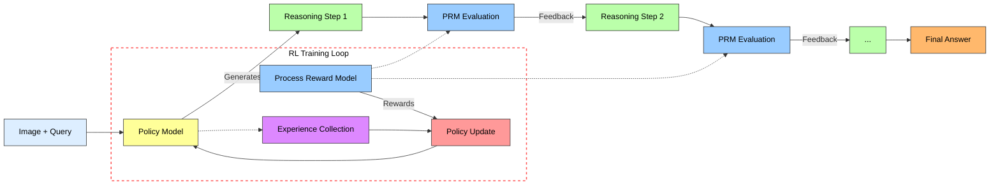

!-- ---
layout: default
---

# RL to Improve Policy Model, and Using PRM at Test-Time

## Value Add of PRMs

- PRM provides **real-time feedback** during inference
- Guides the policy model to generate **high-quality reasoning traces**
- Enables **test-time scaling** without additional training
- Results in more **reliable and interpretable** multimodal reasoning
- **RL training loop** uses PRM rewards to continuously improve policy model -->